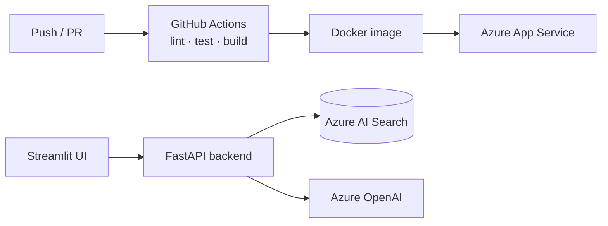

# RAG CI/CD Template — GitHub Actions + Docker

> A production-shaped RAG chatbot with **CI/CD baked in** — GitHub Actions, Docker, a Streamlit UI, and a FastAPI backend. Fork it as the starting point for a deployable RAG service.

    


---

## Why this exists

Most RAG repos stop at "runs on my machine." This one ships the boring, essential parts: containerized build, GitHub Actions pipeline, environment config, health checks, and a deploy path to Azure App Service.

## Architecture



## Features
- **GitHub Actions** CI/CD (build, deploy) with secrets via GitHub Secrets.
- **Docker** container + compose for local.
- **RAG core** — Blob ingestion, hybrid search, strict grounding, SAS-secured citations.
- Health endpoints + operational docs.

## Quickstart
```bash
cp .env.example .env
docker compose up            # UI + API locally
```

## Roadmap
- **Eval quality gate** — run the [rag-evaluation-harness-python](https://github.com/srikanthot/rag-evaluation-harness-python) suite in CI and block merge on regression.
- Bicep/Terraform IaC; a parallel AWS deploy job.

---
